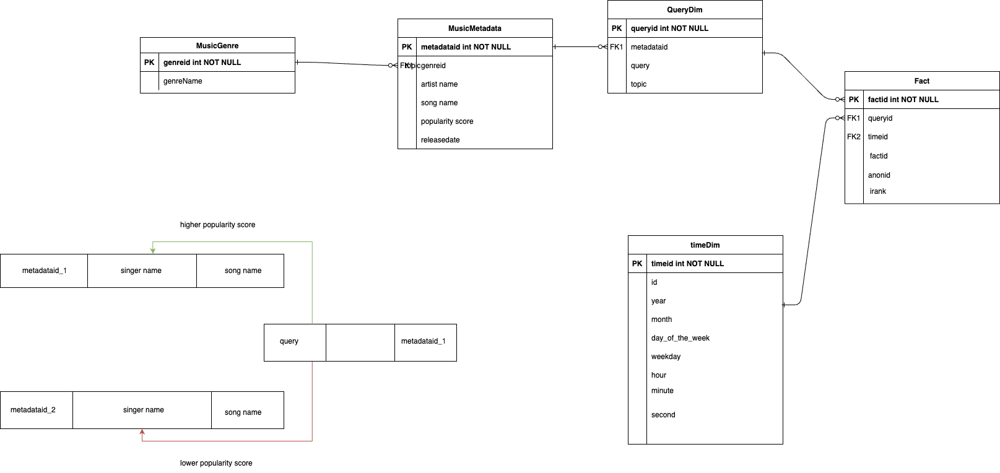

# 🎧 Music Trends and User Search Analysis

### Authors  
**Shadi Farzankia**, **Mina Aminpour**, **Nahid Taherkhani**, **Syed Muhammad Ali Fatmi**, **Medhansh Ahuja**, **Tharun Johny Mekala**, **Ahsan**

**Date:** 2006 Data (Project Completed: 2025)

---

## 📘 Project Overview  
This project analyzes **36 million music-related search queries** from the **AOL Search Log Dataset (2006)** to uncover user behavior patterns and trends in online music discovery.  
By combining large-scale search data with external music metadata, we identified insights into user engagement, platform popularity, and temporal listening patterns.

---

## 🎯 Objectives  
- Analyze large-scale search data to understand **music discovery and listening behavior**  
- Identify **peak search times**, **popular platforms**, and **genre preferences**  
- Study **correlation between search frequency and music popularity**  
- Integrate external music metadata (from Waterloo Music Dataset) via **web scraping**  
- Present insights through **data storytelling and visualization**

---

## 🧩 Data Sources  

### 1. **AOL Search Query Logs (2006)**  
- Over **36 million queries** analyzed  
- Filtered for **music-related keywords** (e.g., song titles, artists, genres, platforms)  
- Extracted data across **March, April, and May 2006**  

### 2. **Waterloo Music Dataset**  
- Collected from the **University of Waterloo Music Database** (Dave Tompkins)  
- Contained metadata such as:  
  - 🎵 Song title  
  - 🎤 Singer  
  - 🎧 Genre  
  - ⭐ Popularity score  

- Data integrated with **AOL search logs** via **Python (BeautifulSoup)** web scraping.  

---

## 🔍 Methodology  

### 🧮 Schema Design  


The project used **three main tables** from the virtual machine data:  
- `facts` — contains search frequency, counts, and sessions  
- `querydim` — includes query text and type (e.g., music, concert, platform)  
- `timedim` — stores timestamps, weekday, hour, and month info

### Whole Database Desing


### 🧠 Key Analytical Steps  
1. **Data Extraction & Cleaning:** Filtered and structured AOL search logs  
2. **Integration:** Enriched data with external metadata from Waterloo Music Dataset  
3. **Exploratory Analysis:** Time-based trends, platform usage, and search behavior  
4. **Inferential Analysis:** Correlation between popularity scores and search counts  
5. **Visualization:** Interactive charts built with **D3.js** and SQL-based aggregations  

---

## 📊 Research Questions & Findings  

### 🎵 Q1: What are the most popular musical platforms?  

- **YouTube** dominated all months in 2006.  
- **Pandora** ranked second where available.  
- Seasonal peaks observed in **March (Grammy Awards)** and **May (Eurovision)**.  

---

### ⏰ Q2: When are peak times for music-related searches?  
<p align="center">
  
  
</p>

- **Most active days:** Sunday and Saturday.  
- **Lowest searches:** Friday.  
- **Peak hours:** 7 PM – 9 PM (evening leisure time).  
- **Lowest activity:** 2 AM – 6 AM.  

---

### 💫 Q3: Correlation between search frequency and music popularity  
<p align="center">
  
  
</p>
- Found a **weak positive correlation** between search volume and song popularity.  
- Popularity is **not solely determined by search count** — cultural relevance and niche appeal also influence popularity.  

---

### 🎤 Q4: Concert Search Trends  

- **March** (655 searches) and **May** (639) saw peak concert searches.  
- **Friday** and **Saturday** had highest concert-related activity.  
- **Top genres:** Jazz (1,145 searches), Rock (493).  

---

### ⏱️ Q5: Session Duration Analysis  

- Average music-related search session length: **~25,336 seconds (~7 hours)**.  
- Consistent engagement except for low-activity anomalies (e.g., April 13, 2006 — Iowa tornado event).  

---

## 📈 Insights & Conclusions  
- Music interest spikes around **major events** (Grammy Awards, Eurovision, concerts).  
- **Evening hours** are prime for music exploration.  
- **YouTube** was the dominant discovery platform even in early years.  
- Weak correlation between search frequency and song popularity suggests that **interest ≠ chart success**.  

---

## 🚀 Future Improvements  
- Integrate **album release dates** and **regional event data** for contextual insights.  
- Incorporate **location-based filtering** to study geographic music preferences.  
- Extend analysis across **multiple years** to observe long-term evolution in user behavior.  

---

## 🧰 Tools & Technologies  
| Category | Tools Used |
|-----------|------------|
| Data Analysis | **SQL**, **Python** |
| Web Scraping | **BeautifulSoup** |
| Visualization | **D3.js**, charts, interactive dashboards |
| Statistical Methods | Descriptive analytics, Inferential statistics |
| Platform | Data processed and integrated via local VM + Python environment |

---

## 🧠 Key Takeaways  
- Behavioral data from web searches can reveal **real-world music engagement trends**.  
- Integration of structured logs with web-scraped metadata creates a **richer analytical context**.  
- Data storytelling bridges technical insights and cultural understanding of **how users discover music online**.  

---

## 📁 Repository Structure  

```
Music-Trends-and-User-Search/
├── data/ # Raw and cleaned AOL + Waterloo datasets
├── notebooks/ # SQL and Python analysis scripts
├── images/ # D3.js charts and exported graphs
├── reports/ # PDF and presentation files
└── README.md
```

---

## 🧩 Project Summary  
- **Analyzed over 36 million search logs** to uncover behavioral trends in music-related user activity from AOL query data (2006).  
- **Integrated external music metadata** from the Waterloo Music Dataset using web scraping with Python (BeautifulSoup).  
- **Conducted exploratory and inferential analysis** to identify peak search times and popular platforms.  
- **Analyzed correlation** between search frequency and music popularity.  
- **Developed insights** on user engagement trends and music discovery behavior using data storytelling techniques.  

**Tools:** SQL, Python, BeautifulSoup, D3.js, descriptive analytics, inferential statistics.  

---

## 📄 License  
This project is for academic and research purposes only.
